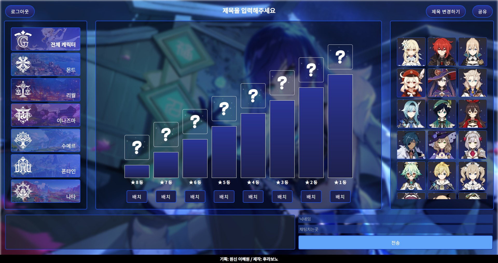

# 🌟 Genshin Impact Tier List Web App

A full-stack web application for creating, sharing, and discussing **Genshin Impact Tier Lists**!  
Powered by **React**, **TailwindCSS**, **Express**, and **MongoDB**.


---

## ✨ Features

- 🎨 Interactive **Tier List Editor**  
- 🌐 Share your rankings with others in real-time  
- 💬 Real-time **Chat Room** with Socket.IO  
- 🔐 User Authentication with JWT  
- 🌙 Beautiful responsive UI with TailwindCSS

---

## 📸 Demo Screenshots



### 🔥 Tier List Editor
### 💬 Chat Room available

---

## 🛠️ Tech Stack

| Frontend     | Backend      | Real-Time | Database  |
|--------------|--------------|-----------|-----------|
| React        | Express.js   | Socket.IO | MongoDB   |
| TailwindCSS  | Node.js      |           | Mongoose  |

---

# 🧠 Folder Structure
```
genshin-impact-tier-list/
├── client/           # React + Tailwind frontend
├── server/           # Express backend with MongoDB
├── public/
├── assets/           # Images for README or app
└── README.md
```

---

# 🖥️  Set up Environment Variables

###  🔵 For Backend (/server/.env):

```
PORT=5000
DB_URI=your_mongodb_connection_string
JWT_SECRET=your_jwt_secret

```

> ⚠️ **Important:** Do **not** upload your `.env` file to GitHub.  
> It contains sensitive data like API keys, database credentials, and secrets.  
> Use `.gitignore` to exclude it from version control.


### Install Dependencies
```
# Root directory
npm install

# Client
cd client
npm install

# Server
cd ../server
npm install
```

### Start the Development Servers

```
# In one terminal (for client)
cd client
npm start

# In another terminal (for server)
cd server
npm run dev
```


---


# 📦 Deployment

🔵 Frontend: Deployed as Static Site on Render

🔴 Backend: Deployed as Web Service on Render

Ensure CORS and socket URLs are properly set for production

---

## 🚀 Getting Started

### 1. Clone the Repository

```bash
git clone https://github.com/your-username/genshin-impact-tier-list.git
cd genshin-impact-tier-list
